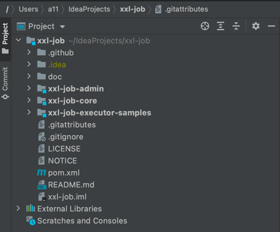
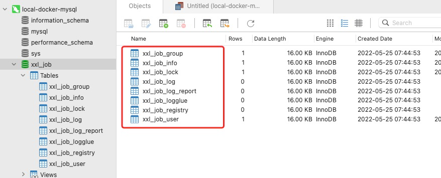
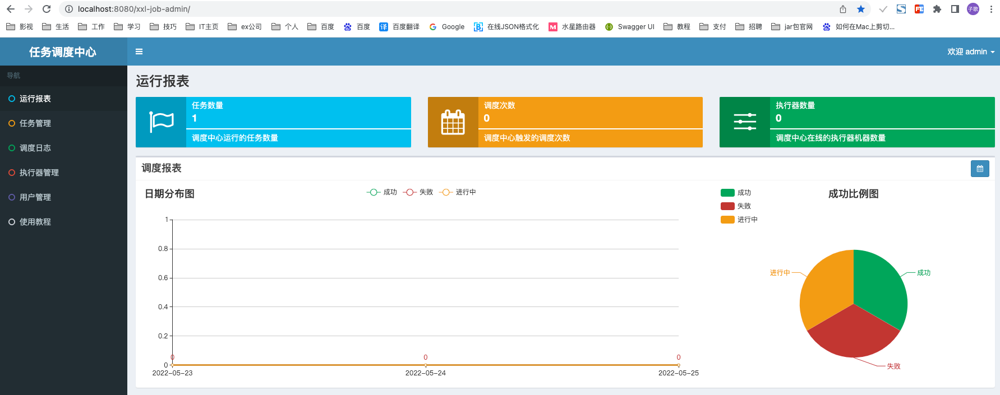
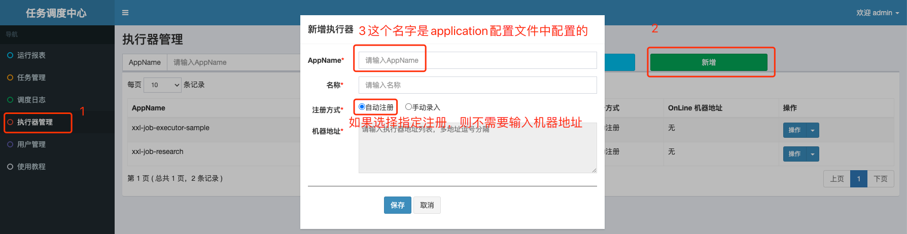
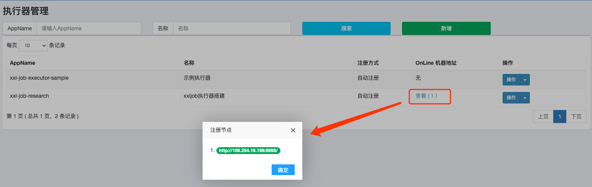
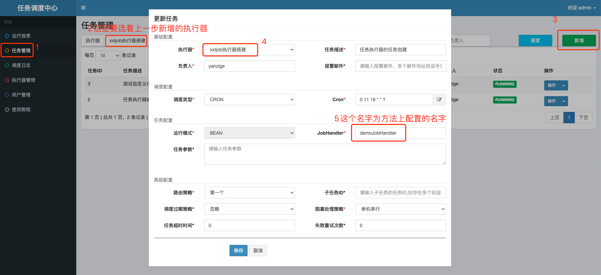
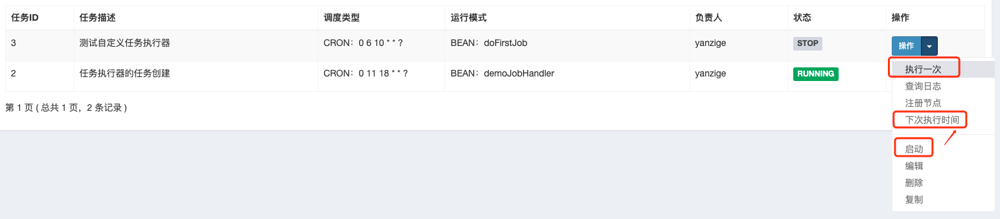

# XXL-Job定时任务搭建

## 说明
关于xxl-job定时任务实现方案说明:
* xxl-job的源码位置 GitHub代码地址https://github.com/xuxueli/xxl-job GitEE代码地址https://gitee.com/xuxueli0323/xxl-job
* xxl-job是一个中心化的分布式任务调度器
* xxl-job组成主要分为任务调度中心（中心化）和任务执行器（分布式）


## 步骤
### 一、运行调度中心
#### 1、从gitee上克隆源代码到本地，下载到idea后，其目录结构如下
* doc 架构图、文档、以及sql脚本
* xxl-job-admin 调度中心admin的相关代码
* xxl-job-core xxl-job的核心代码
* xxl-jbo-executor-samples 执行器代码的示例，里面包含两部分的示例（1）无框架的示例（2）springboot的整合示例

  
#### 2、首先启动xxl-job-admin，在启动调度中心前需要先初始化sql脚本，数据库为mysql，脚本文件在doc.db目录下
初始化完成后如图 

#### 3、修改xxl-job-admin 中的配置文件application.properties
* 数据库链接的配置、用户名、密码等
* 报警邮件通知地址、账号、密码等

#### 4、修改xxl-job-admin 中的日志配置文件logback.xml，修改日志保存地址（注：改地址需要有写操作权限）

#### 5、启动XxlJobAdminApplication服务，如果是用于服务端，则需要使用maven打包成jar包，然后在服务器端通过命令运行
* 单次运行命令 java -jar xxx.jar
* 后台运行 nohup java -jar xxx.jar &

#### 6、访问调度中心
* http://localhost:8080/xxl-job-admin
* 默认用户名：admin 默认密码：123456
* 登录后页面如下图  
  

### 二、编写任务执行器代码
#### 1、pom文件中导入xxl-job依赖的jar包
```xml
        <dependency>
            <groupId>com.xuxueli</groupId>
            <artifactId>xxl-job-core</artifactId>
            <version>2.3.0</version>
        </dependency>
```

#### 2、添加日志配置文件logback.xml
```xml
<?xml version="1.0" encoding="UTF-8"?>
<configuration debug="false" scan="true" scanPeriod="1 seconds">

    <contextName>logback</contextName>
    <property name="log.path" value="/Users/a11/IdeaProjects/logs/xxl-job/handler/xxl-job-research.log"/>

    <appender name="console" class="ch.qos.logback.core.ConsoleAppender">
        <encoder>
            <pattern>%d{HH:mm:ss.SSS} %contextName [%thread] %-5level %logger{36} - %msg%n</pattern>
        </encoder>
    </appender>

    <appender name="file" class="ch.qos.logback.core.rolling.RollingFileAppender">
        <file>${log.path}</file>
        <rollingPolicy class="ch.qos.logback.core.rolling.TimeBasedRollingPolicy">
            <fileNamePattern>${log.path}.%d{yyyy-MM-dd}.zip</fileNamePattern>
        </rollingPolicy>
        <encoder>
            <pattern>%date %level [%thread] %logger{36} [%file : %line] %msg%n
            </pattern>
        </encoder>
    </appender>

    <root level="info">
        <appender-ref ref="console"/>
        <appender-ref ref="file"/>
    </root>

</configuration>
```

#### 3、编写application.properties配置文件
```properties
server.port=8081

logging.config=classpath:logback.xml

spring.application.name=xxljobresearch

### 调度中心部署跟地址 [选填]：如调度中心集群部署存在多个地址则用逗号分隔。执行器将会使用该地址进行"执行器心跳注册"和"任务结果回调"；为空则关闭自动注册；
xxl.job.admin.addresses=http://127.0.0.1:8080/xxl-job-admin

### 执行器通讯TOKEN [选填]：非空时启用；
xxl.job.accessToken=default_token

### 执行器AppName [选填]：执行器心跳注册分组依据；为空则关闭自动注册
xxl.job.executor.appname=xxl-job-research

### 执行器注册 [选填]：优先使用该配置作为注册地址，为空时使用内嵌服务 ”IP:PORT“ 作为注册地址。从而更灵活的支持容器类型执行器动态IP和动态映射端口问题。
xxl.job.executor.address=

### 执行器IP [选填]：默认为空表示自动获取IP，多网卡时可手动设置指定IP，该IP不会绑定Host仅作为通讯实用；地址信息用于 "执行器注册" 和 "调度中心请求并触发任务"；
xxl.job.executor.ip=

### 执行器端口号 [选填]：小于等于0则自动获取；默认端口为9999，单机部署多个执行器时，注意要配置不同执行器端口；
xxl.job.executor.port=9999

### 执行器运行日志文件存储磁盘路径 [选填] ：需要对该路径拥有读写权限；为空则使用默认路径；
xxl.job.executor.logpath=/Users/a11/IdeaProjects/logs/xxl-job/handler

### 执行器日志文件保存天数 [选填] ： 过期日志自动清理, 限制值大于等于3时生效; 否则, 如-1, 关闭自动清理功能；
xxl.job.executor.logretentiondays=10
```

#### 4、从 xxl-job-executor-samples 目录下找到springboot中XxlJobConfig文件，复制到自己项目中

#### 5、编写自己的任务运行代码（也可以直接从xxl-job-executor-samples的springboot文件夹中直接复制SampleXxlJob类），下面代码为我自己编写代码
```java
@Slf4j
@Component
public class DoXxlJob {

  // 注：XxlJob("doFirstJob") 中的名字doFirstJob为执行器JobHandler的名字，需要在调度中心进行配置
  @XxlJob("doFirstJob")
  public void doFirstJob(){
    log.info("通过定时任务执行开始");
    // 编写业务逻辑
    log.info("通过定时任务执行结束");
  }
}
```

#### 6、到这里，执行器的代码编写完成，后面就需要到调度中心的网页【新增执行器】+对应执行器下【新增任务】

### 三、配置执行器和任务并进行调度
#### 1、登录调度中心 http://localhost:8080/xxl-job-admin/
* 默认用户名：admin 默认密码：123456

#### 2、新增执行器，执行器的AppName为配置文件application.properties中的xxl.job.executor.appname


#### 3、配置完成后，此时启动执行器项目，则可以在执行器列表中看到


#### 4、新增任务
* 新增任务的时候，需要指定执行器，当前新增的任务就是上一步创建的执行器的任务。如果存在多个执行器，需要找到任务对应的执行器
* 编辑类容，如：负责人、任务描述、报警邮件、调度类型等，我们一般使用cron表达式，表达式的配置不懂可以百度
* JobHandler的值为需要执行的方法@XxlJob("doFirstJob")上的名字：本例为doFirstJob

  
#### 5、通过调度中心进行运行
* 可以在操作中点击"执行一次"，点击后可以到控制台或者日志地址中查看运行日志
* 多次点击"执行一次"，可以点击查询日志，查看运行状态
* 还可以查看"下次执行时间"，不过下次是否执行需要的前提是任务已经被启动，只有被启动的任务才会自动执行
* "启动"按钮就是启动任务，任务可以自动执行，如果不启动，虽然配置了任务，但是任务不会自动执行

  
### 总结：
* 基本操作过程就到此完结，其他一些如：路由策略、运行模式、调度过期、指定分片任务、阻塞策略等可以查看官方文档
* xxl-job开发搭建简单，后期其实就***只需要开发@XxlJob("doFirstJob")对应的方法***和***配置一下任务***即可运行
